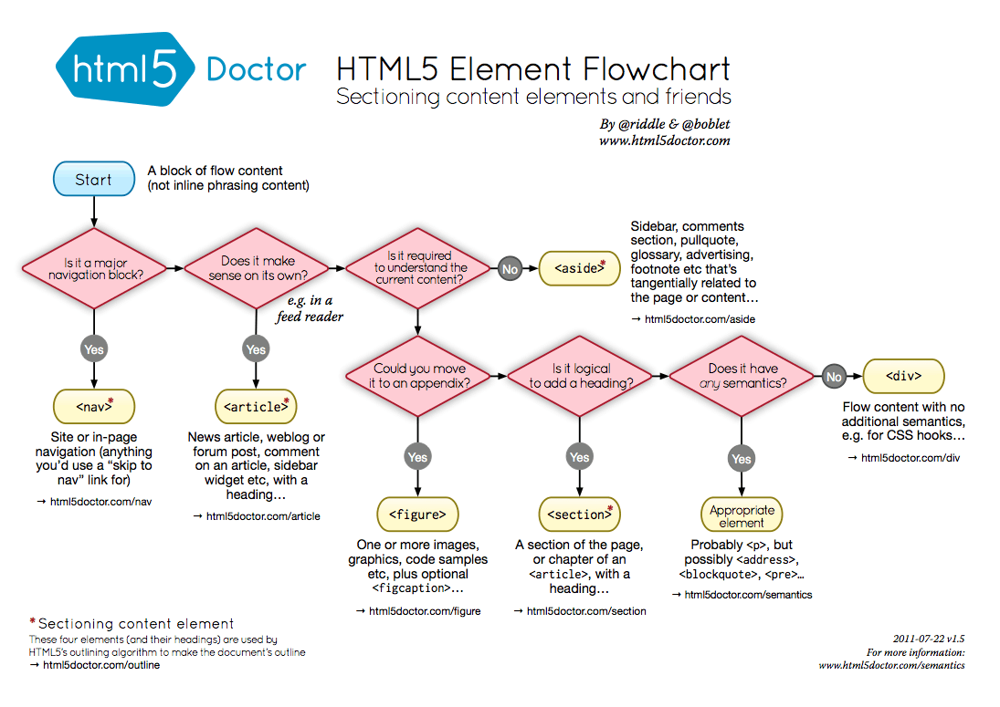

# Requirement
```
•A page to introduce yourself – Your values, interest and personality
•A page to share your past school experience before poly
•A page to describe current experience in SP and School of Computing
•A page to describe your course and your career prospect
•A page to get feedback from visitor (Not required to send data to web server)
```
# Tools
```
https://www.16personalities.com/
```
```
•Use of colour
•Layout design & Navigation system.
•All content must be user-centric, well-written, accurate, informative, and worth reading for the target audience. 
•Follow closely to the Layout Design using wireframes.
•Organize page content with HTML5 sectioning elements.
•Link to files (using relative paths) within a website and external website.
•Include special characters and images.
•Insert a web table by
	oCreate rows and columns
	oCreate cells that span multiple rows and columns
	oCreate row and column groups
•Create a form and at least 7 different types of controls/widgets.
•HTML Validate form. https://validator.w3.org/
•Apply text, font style and colours in CSS.
•Use contextual selectors.
•Work with attribute selectors, margins and padding selectors.
•Use pseudo-classes and pseudo-elements.
•Define list styles.
•Page Layout using CSS (Floating elements, Layout grid or CSS Positioning Styles)
•Apply CSS styles to a table, rows and column groups.
•Apply CSS style to form, controls and form validation.
•CSS scripts are well-organized & coded optimally.
•CSS Error-free. https://jigsaw.w3.org/css-validator.
•Each image file size <800KB and source quoted.
•Proper viewing
•Comments
•Files and folders are well-organized
•Apply proper file naming convention.
```
# Tools I used
```
https://css-tricks.com/a-complete-guide-to-dark-mode-on-the-web/
https://www.colourlovers.com/palettes/most-favorites/all-time/meta?page=1
https://www.mockplus.com/free-wireframing-tool/
https://www.mockflow.com/
https://tinypng.com
```
# Tools that was dumped
## Website ideas
```
https://tympanus.net/codrops/2021/03/30/inspirational-websites-roundup-24/
```
## Color
```
https://www.colorspire.com/
https://color.adobe.com/create/color-wheel
http://www.colorsontheweb.com/Color-Tools/Color-Wizard
https://www.colourlovers.com/
http://www.alvit.de/web-dev/color-tools-mixers-palettes.html
http://www.cssdrive.com/imagepalette/
https://coolors.co/
https://www.colorspire.com/
https://color.adobe.com/create/color-wheel
http://www.colorsontheweb.com/Color-Tools/Color-Wizard
https://www.colourlovers.com/
http://www.alvit.de/web-dev/color-tools-mixers-palettes.html
```

## Layout
```
https://developer.mozilla.org/en-US/docs/Web/CSS/CSS_Grid_Layout/Relationship_of_Grid_Layout

https://css-tricks.com/css-grid-replace-flexbox/
https://hackernoon.com/the-ultimate-css-battle-grid-vs-flexbox-d40da0449faf (7 Dec 2017)
https://www.webdesignerdepot.com/2018/09/grid-vs-flexbox-which-should-you-choose/ (26 Sept 2019)
https://css-tricks.com/quick-whats-the-difference-between-flexbox-and-grid/
(12th Feb 2019)
https://blog.logrocket.com/flexbox-vs-css-grid/  (6th Apr 2020)
https://www.youtube.com/watch?v=hs3piaN4b5I&ab_channel=LayoutLand 
Flexbox vs. CSS Grid — Which is Better?
(30 Jan 2018)
https://www.youtube.com/watch?v=DXxt4oIAI4Y&ab_channel=Simplilearn
CSS Grid vs Flexbox : Which Is Better? | CSS Grid And Flexbox Tutorial | CSS Tutorial | Simplilearn
(18 Mar 2021)
 
https://www.w3schools.com/css/css3_flexbox.asp
https://www.w3schools.com/css/css_templates.asp
```
## Forms
```
https://www.w3schools.com/html/html_forms.asp

Best practice for forms
https://www.jotform.com/form-design/
[Jotform, 21st May 2021]
https://xd.adobe.com/ideas/principles/web-design/best-practices-form-design/
[Adobe XD, 12th Mar 2020]
https://medium.com/nextux/form-design-best-practices-9525c321d759
[Andrew Coyle, 4th Aug 2020]
https://www.smashingmagazine.com/2018/08/best-practices-for-mobile-form-design/
[Smashing Magazine, 28th Aug 2018]
https://uxplanet.org/the-18-must-do-principles-in-the-form-design-fe89d0127c92
[UX planet, 27th Mar 2017]
```
## Stock photos
```
https://stocksnap.io/
https://www.pexels.com/
https://picjumbo.com/
https://publicdomainarchive.com/
http://imcreator.com/free
https://www.foodiesfeed.com/
https://gratisography.com/
https://www.istockphoto.com/
https://www.freeimages.com/
Seamless/textured background
https://www.freepik.com/free-photos-vectors/seamless-background
https://www.toptal.com/designers/subtlepatterns/
https://www.transparenttextures.com/
https://lostandtaken.com/
Compress/resize images
http://www.imageoptimizer.net/Pages/Home.aspx
http://www.simpleimageresizer.com/
https://resizeimage.net/
Image map generator
 https://www.image-map.net/
```
