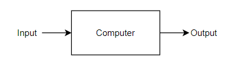
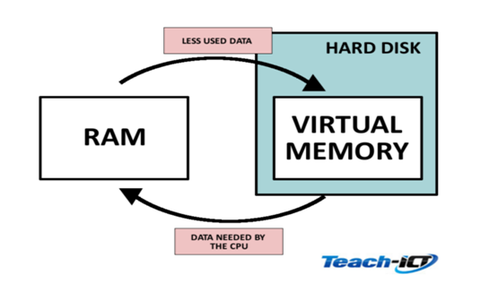

# Basic functions of a computer
```
Input: Receive information
Processing: CPU (brain)
Output: Information from CPU
Storage
```


# CPU
```
CPU: Main processing component
Core:  Works on one task
Multicore: Multiple task
```
# I/O example


# Memory
```
Short term memory: volatile, content is gone when power is off. working storage (RAM)
Long term memory: non-volatile, retain memory when power is off (HDD/SSD)
```
# Virtual Memory


# BIOS/CMOS
```
BIOS stands for “Basic Input/Output System”, and is a type of firmware stored on a chip on your motherboard.
power-on self test (POST)
Stores date/time
```

# Computer Bus
```
Bus: soldered wires in motherboard for communication
Data bus: Send data from RAM to CPU/IO vice versa (binary)
Address bus: carry address signals, Location of devices
Control bus: carry control signals, Read/Write
CPU > RAM > I/O
```

# I/O polling and interrupt
```
Polling: CPU check at regular interval of I/O devices (Heartbeat)
Interrupt: I/O devices signal to CPU
*To Run Tasks*
```

# HDD
```
Magnetic disk to store data
Arm to read and write
```

# SSD
```
Use in place of hard drives
Use flash memory
More expenesive
Often found in mobile devices
```

# Network Communication
```
Network consists of two or more computers
Communication via radio waves
```

# NIC
```
MAC address: Unique identifier (can be spoofed)
```
