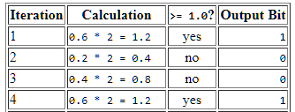
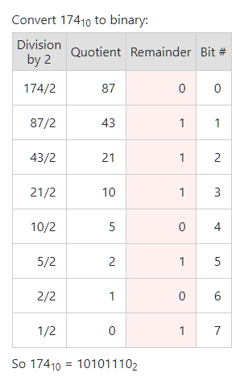
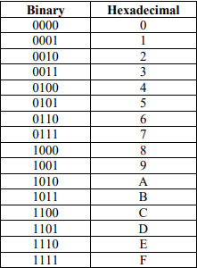

# Expanded Form
## Decimal
```
69.69 = 6x10¹ * 9x10⁰ * 6x10⁻¹ * 9x10⁻²
```
## Binary
```
101.111₂ 1x2² * 1x2⁰ * 1x2⁻¹ * 1x2⁻² * 1x2⁻³
```

# Conversion
## Converting float to binary

```
69.6 =  1000101.⁻1⁻0⁻0⁻1⁻₂ (Draw a line over repeating 1001)
```
## **Caluclation is backwards!!!*


## Hex to binary (vice-versa)
