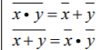
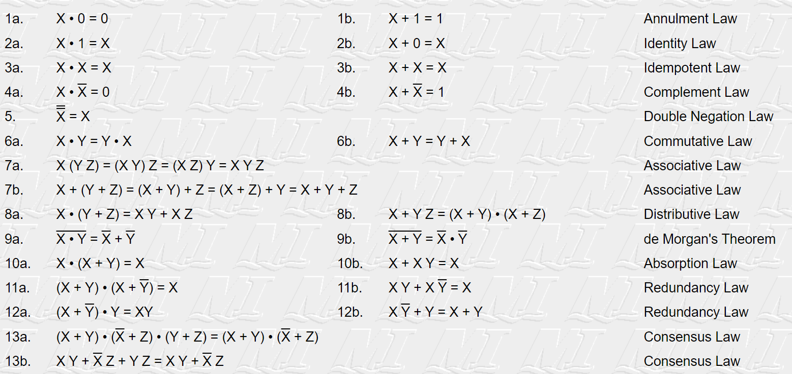

```
+ (Or)
• (And)
- (Not)
```
# Distributive Laws
```
x•(y+z) = (x•y) + (x•z)
x+(y•z) = (x+y) • (x+y)
```
# Identity Laws
```
x•1=x
x+0=x
```
# Complement Laws
```
x•x̄=0
x+x̄=1
```
# Idempotent Laws
```
x•x=x
x+x=x
```
# Bound Laws
```
x•0=0
x+1=1
```
# De Morgan's Laws

# Absorption Laws
```
x•(x+y) =x+xy=x(1+y)=x(1)= x
x+(x•y) =(x+x)•(x+y)=x•(x+y)=^= x
x•(x̄+y) =(x•x̄)+(x•y)=0+(x•y)= x•y
x+(x̄•y) =(x+x̄)•(x+y)=1•(x+y)= x+y
```

# Dual
```
• <-> +
1 <-> 0
```

# Sum of Product
```
Output: '1'
Input: x = '1', x̄ = '0'
```

# Product of Sum
```
Output: '0'
Input: x = '0', x̄ = '1'
```

